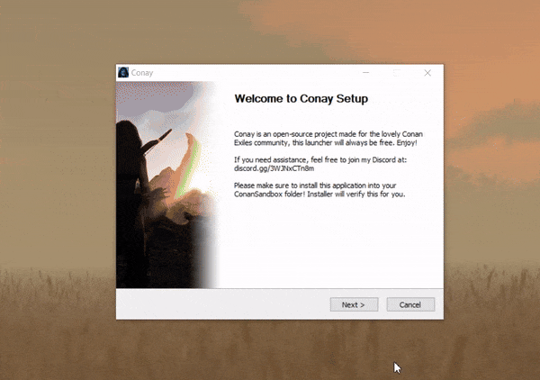

# Conay

[](https://github.com/RatajVaver/conay/blob/main/LICENSE)
[](https://discord.gg/3WJNxCTn8m)



Conay is a launcher and a mod updater for Conan Exiles. Main problem this app solves is the need to manually resubscribe Steam Workshop addons after every update unless you want to wait for Steam to pick it up by itself. This launcher can read your modlist as well as load modlists from supported servers to order them for you and check for updates and force their download, saving you a headache.

Conay is also useful for people who want to play on multiple servers with mods or in singleplayer with a different set of mods. Conay can easily disable all your mods and restore them with your next session (follow instructions in the Usage section). You can also save modlists even for unsupported servers on your own and load them later.

## Installation

Download the latest release from the [Releases](https://github.com/RatajVaver/conay/releases) tab.

If you're using the new **Conay Installer**, follow the instructions from the installation wizard and ignore everything below this line.

---

### Manual installation

Extract the Conay folder into `steamapps\common\Conan Exiles\ConanSandbox`.

It should look like this:


This folder should contain your `Conay.exe` as a single file.
Alternatively it can contain `conay.py` if you want to run the Python script directly.
You can also build the exe on your own from the source using pyinstaller.

Need assistance with installation? Join my [Discord](https://discord.gg/3WJNxCTn8m).

## Usage

For basic usage (updating your currently loaded mods) just run the `Conay.exe` file.

You can also create a desktop shortcut (and add parameters as per advanced usage section if you want).

### Advanced usage

This app supports many options using parameters (arguments), you can call them from the command line or you can add them to your desktop shortcut.

Target of your desktop shortcut should look something like this:
```sh
"...\steamapps\common\Conan Exiles\ConanSandbox\Conay\Conay.exe" --server halcyon --launch
```

#### Parameters

Forcing update of all mods (SteamCMD will check updates on it's own):

```sh
Conay.exe --force
```

Running the game without mods (disabling them for the session):
```sh
Conay.exe --nomods --launch
```

Restore previously saved mods (after disabling them):
```sh
Conay.exe --restore
```

Display only plain text (hide emojis and colors on older CMD):
```sh
Conay.exe --plain
```

Show the whole SteamCMD output instead of default progress bars:
```sh
Conay.exe --verbose
```

Save the current modlist (this will create a JSON file in servers folder):
```sh
Conay.exe --copy test
```

Choosing a server to load and order modlist automatically:

```sh
Conay.exe --server halcyon
```

You can find the supported servers in [servers](https://github.com/RatajVaver/conay/tree/main/servers) directory.

Add `--launch` parameter to run the game automatically after updates are done. If you want to use Conay just to switch your modlist or update the mods without running the game, do not use this parameter.

You can combine parameters as you wish. You can also use parameter `-h` to display help with list of all parameters.

## Bug reports

Have you found a bug? Please report it in the issues tab.

Do you have questions? Join my [Discord](https://discord.gg/3WJNxCTn8m) and feel free to ask.

## Contributions

Do you want to expand this project? Feel free to fork it and open PR. You can also add your server into the [servers](https://github.com/RatajVaver/conay/tree/main/servers) directory. You can use `--copy name` to create the JSON file, don't forget to add the IP and server name. Keep your modlist updated to make it easier for your players.