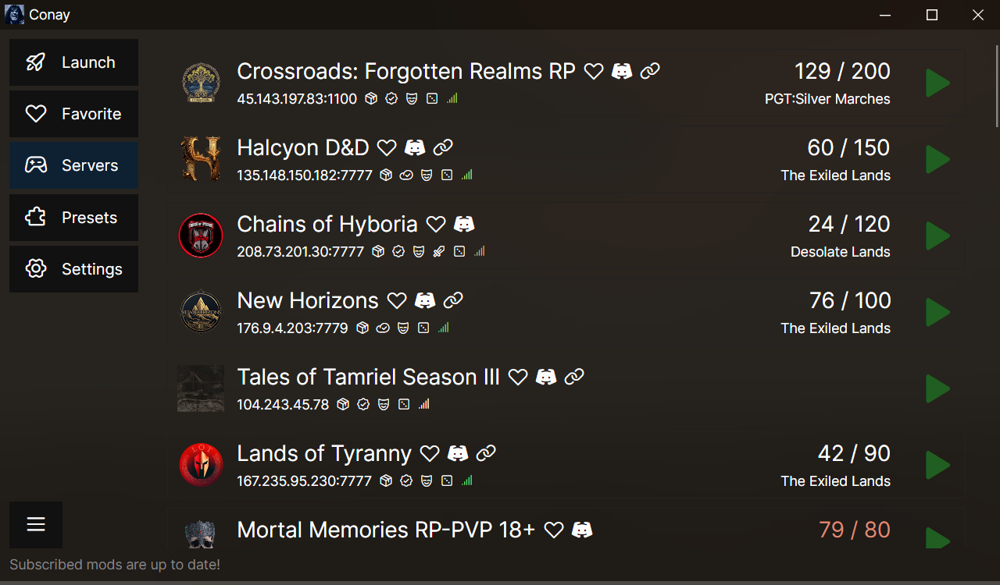

# Conay

Conay is a launcher and a mod updater for Conan Exiles that saves you a headache.

Main problem this app solves is the need to manually resubscribe Steam Workshop addons after every mod update. This launcher can read your current modlist as well as load modlists from supported servers to put mods into correct order and update them for you. With Conay, you won't see the mod mismatch screen ever again.

Conay is also useful for people who want to play on multiple servers with mods or in singleplayer with a different set of mods. Conay can swap your modlists with a click of a button. Even when joining a server for the first time, you won't have to restart your game to reorder loaded mods. You can also save modlists even for unsupported servers on your own and load them later.

## Installation

Download the latest release from the [Releases](https://github.com/RatajVaver/conay/releases) tab.

Follow the instructions in the installation wizard, or unpack the files manually.

Need assistance with installation? Join my [Discord](https://discord.gg/3WJNxCTn8m).

## Updating

To update to a new version of Conay, simply install it again, files will be overwritten.

Since version 0.1.0 there is also an updater included to download the new installer for you.

## Usage

Simply run `Conay.exe` and select a server you want to join.

Having a desktop shortcut is strongly recommended for ease of use.

If your server is not on the list, you can either ask the server staff to add it to Conay for everyone, or you can connect to it as usual before pressing `Add preset` on the `Presets` tab in Conay, which will save it locally for you only.

If you are using older version of Conay, or want to dive into advanced usage with CLI, please follow the instructions included with older installations.

If you are using **Linux**, Conay works only through Valve's Proton (make sure to force it to use the same version as the game).

## Bug reports

Have you found a bug? Please report it in the issues tab.

Do you have questions? Join my [Discord](https://discord.gg/3WJNxCTn8m) and feel free to ask.

## Contributions

Do you want to expand this project? Feel free to fork it and open PR.

## Supported servers

You can find a list of supported servers on [ratajmods.net/conay/servers](https://ratajmods.net/conay/servers)

If you own a server and want to add it to the list, please follow the instructions on the website.
